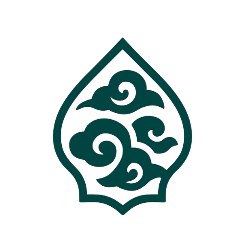

# Welcome to RhamaaCMS

<style>
/* ================================================================
   Landing Page — Forest Sanctuary
   Accessible, responsive light & dark mode
   ================================================================ */

@import url('https://fonts.googleapis.com/css2?family=Cormorant+Garamond:ital,wght@0,400;0,600;0,700;1,400&family=DM+Sans:opsz,wght@9..40,300;9..40,400;9..40,500;9..40,600&display=swap');

/* Root tokens yang mengikuti Material theme */
.lp-root {
  /* Default (light) */
  --lp-bg-page: #FAFAF7;
  --lp-bg-hero: linear-gradient(160deg, #071e17 0%, #0D4A3C 45%, #1E7A63 100%);
  --lp-bg-card: #ffffff;
  --lp-bg-feature: #EDF9F5;
  --lp-bg-feature-border: #D4F1E9;
  
  --lp-text-title: #0D4A3C;
  --lp-text-body: #3A3A36;
  --lp-text-muted: #29977A;
  --lp-text-link: #0D4A3C;
  --lp-text-link-hover: #145C4B;
  
  --lp-border-card: #E4E4DF;
  --lp-border-card-hover: #A8E3D4;
  --lp-border-accent: rgba(200,169,110,0.4);
  
  --lp-gold-500: #C8A96E;
  --lp-gold-400: #D9BE8D;
  --lp-gold-300: #E8D4B0;
  
  --lp-shadow-sm: 0 2px 8px rgba(7, 30, 23, 0.06);
  --lp-shadow-md: 0 4px 20px rgba(7, 30, 23, 0.08);
  --lp-shadow-lg: 0 12px 32px rgba(7, 30, 23, 0.12);
}

/* Dark mode override */
[data-md-color-scheme="slate"] .lp-root,
[data-md-color-scheme="slate"] {
  --lp-bg-page: #0C0C0B;
  --lp-bg-card: #1A1A18;
  --lp-bg-feature: rgba(13, 74, 60, 0.2);
  --lp-bg-feature-border: rgba(200, 169, 110, 0.15);
  
  --lp-text-title: #6CCFB4;
  --lp-text-body: #E4E4DF;
  --lp-text-muted: #A8E3D4;
  --lp-text-link: #D9BE8D;
  --lp-text-link-hover: #E8D4B0;
  
  --lp-border-card: #3A3A36;
  --lp-border-card-hover: #C8A96E;
  --lp-border-accent: rgba(200,169,110,0.25);
  
  --lp-shadow-sm: 0 2px 8px rgba(0,0,0,0.3);
  --lp-shadow-md: 0 4px 20px rgba(0,0,0,0.4);
  --lp-shadow-lg: 0 12px 32px rgba(0,0,0,0.5);
}

/* Container untuk scope variable */
.md-content__inner {
  /* Inherit dari lp-root */
}

/* Hero Section */
.lp-hero {
  position: relative;
  text-align: center;
  padding: 5rem 2rem 4rem;
  margin: -1.5rem -1.5rem 3rem;
  background: linear-gradient(160deg, #071e17 0%, #0D4A3C 45%, #1E7A63 100%);
  overflow: hidden;
}

.lp-hero::before {
  content: '';
  position: absolute;
  inset: 0;
  background:
    radial-gradient(ellipse 60% 50% at 15% 30%, rgba(200,169,110,0.12) 0%, transparent 60%),
    radial-gradient(ellipse 40% 60% at 85% 70%, rgba(61,184,150,0.08) 0%, transparent 60%);
  pointer-events: none;
}

/* Decorative botanical rings */
.lp-hero::after {
  content: '';
  position: absolute;
  top: -40px;
  right: -40px;
  width: 280px;
  height: 280px;
  border: 1px solid rgba(200,169,110,0.12);
  border-radius: 50%;
  pointer-events: none;
}

.lp-hero-inner {
  position: relative;
  z-index: 1;
}

/* Logo */
.lp-logo-wrap {
  display: inline-flex;
  align-items: center;
  justify-content: center;
  margin-bottom: 2rem;
  position: relative;
}

.lp-logo-wrap::before {
  content: '';
  position: absolute;
  inset: -16px;
  border: 1px solid rgba(200,169,110,0.2);
  border-radius: 50%;
  animation: ring-pulse 3.5s ease-in-out infinite;
}

@keyframes ring-pulse {
  0%, 100% { opacity: 0.4; transform: scale(1); }
  50%       { opacity: 0.9; transform: scale(1.06); }
}

.lp-logo {
  width: 120px;
  height: 120px;
  object-fit: contain;
  filter: drop-shadow(0 8px 32px rgba(200,169,110,0.3)) brightness(1.1);
  animation: logo-float 5s ease-in-out infinite;
}

@keyframes logo-float {
  0%, 100% { transform: translateY(0); }
  50%       { transform: translateY(-6px); }
}

/* Wordmark — always gold gradient for visibility */
.lp-title {
  font-family: 'Cormorant Garamond', Georgia, serif !important;
  font-size: 4.5rem !important;
  font-weight: 700 !important;
  line-height: 1 !important;
  margin: 0 0 0.4rem !important;
  letter-spacing: -0.02em !important;
  background: linear-gradient(135deg, #E8D4B0 0%, #C8A96E 40%, #D9BE8D 70%, #E8D4B0 100%);
  background-size: 200% auto;
  -webkit-background-clip: text !important;
  -webkit-text-fill-color: transparent !important;
  background-clip: text !important;
  animation: shimmer-text 4s linear infinite;
}

@keyframes shimmer-text {
  0%   { background-position: 0% center; }
  100% { background-position: 200% center; }
}

.lp-sub {
  font-family: 'DM Sans', system-ui, sans-serif;
  font-size: 0.85rem;
  font-weight: 400;
  letter-spacing: 0.28em;
  text-transform: uppercase;
  color: rgba(200,169,110,0.7);
  margin-bottom: 2rem;
}

/* Badges */
.lp-badges {
  display: flex;
  justify-content: center;
  flex-wrap: wrap;
  gap: 0.5rem;
  margin-bottom: 2.5rem;
}

.lp-badge {
  display: inline-flex;
  align-items: center;
  gap: 0.35rem;
  padding: 0.3rem 0.75rem;
  border-radius: 99px;
  font-family: 'DM Sans', sans-serif;
  font-size: 0.72rem;
  font-weight: 500;
  letter-spacing: 0.04em;
  border: 1px solid;
}

.lp-badge-green {
  background: rgba(61, 184, 150, 0.12);
  border-color: rgba(61, 184, 150, 0.35);
  color: #3DB896;
}

[data-md-color-scheme="slate"] .lp-badge-green {
  background: rgba(108, 207, 180, 0.1);
  border-color: rgba(108, 207, 180, 0.3);
  color: #6CCFB4;
}

.lp-badge-gold {
  background: rgba(200, 169, 110, 0.12);
  border-color: rgba(200, 169, 110, 0.4);
  color: #D9BE8D;
}

.lp-badge-blue {
  background: rgba(97, 175, 239, 0.12);
  border-color: rgba(97, 175, 239, 0.35);
  color: #61afef;
}

/* CTAs */
.lp-cta {
  display: flex;
  justify-content: center;
  flex-wrap: wrap;
  gap: 0.875rem;
}

.lp-btn {
  display: inline-block;
  padding: 0.875rem 2.25rem;
  font-family: 'DM Sans', sans-serif;
  font-size: 0.82rem;
  font-weight: 600;
  letter-spacing: 0.08em;
  text-transform: uppercase;
  border-radius: 0.375rem;
  text-decoration: none !important;
  border: none !important;
  transition: all 0.28s cubic-bezier(0.22, 1, 0.36, 1);
}

.lp-btn-primary {
  background: linear-gradient(135deg, #C8A96E 0%, #D9BE8D 100%);
  color: #071e17 !important;
  box-shadow: 0 4px 16px rgba(200,169,110,0.3);
}

.lp-btn-primary:hover {
  transform: translateY(-2px);
  box-shadow: 0 8px 28px rgba(200,169,110,0.4);
  color: #071e17 !important;
}

.lp-btn-outline {
  background: transparent;
  color: rgba(255,255,255,0.9) !important;
  border: 1px solid rgba(200,169,110,0.45) !important;
}

.lp-btn-outline:hover {
  background: rgba(200,169,110,0.12);
  border-color: rgba(200,169,110,0.7) !important;
  color: #E8D4B0 !important;
}

/* Divider ornament */
.lp-ornament {
  display: flex;
  align-items: center;
  justify-content: center;
  gap: 1rem;
  margin: 3rem 0;
  color: var(--lp-gold-500);
  opacity: 0.5;
}

.lp-ornament::before,
.lp-ornament::after {
  content: '';
  flex: 1;
  height: 1px;
  background: linear-gradient(90deg, transparent, var(--lp-gold-500));
}

.lp-ornament::after {
  background: linear-gradient(90deg, var(--lp-gold-500), transparent);
}

/* Template cards — menggunakan CSS variables */
.lp-templates {
  display: grid;
  grid-template-columns: repeat(auto-fit, minmax(280px, 1fr));
  gap: 1.25rem;
  margin: 2rem 0 3rem;
}

.lp-card {
  background: var(--lp-bg-card);
  border: 1px solid var(--lp-border-card);
  border-radius: 0.75rem;
  padding: 1.75rem;
  position: relative;
  overflow: hidden;
  transition: all 0.28s cubic-bezier(0.22, 1, 0.36, 1);
  box-shadow: var(--lp-shadow-sm);
}

.lp-card::before {
  content: '';
  position: absolute;
  top: 0; left: 0; right: 0;
  height: 3px;
  background: linear-gradient(90deg, #0D4A3C, #C8A96E, #0D4A3C);
  background-size: 200% auto;
  opacity: 0;
  transition: opacity 0.28s;
}

.lp-card:hover {
  transform: translateY(-3px);
  border-color: var(--lp-border-card-hover);
  box-shadow: var(--lp-shadow-lg);
}

.lp-card:hover::before {
  opacity: 1;
}

.lp-card-featured {
  border-color: var(--lp-border-accent);
  box-shadow: var(--lp-shadow-md), 0 0 0 1px var(--lp-border-accent);
}

.lp-card-badge {
  position: absolute;
  top: 1rem;
  right: 1rem;
  padding: 0.2rem 0.6rem;
  background: linear-gradient(135deg, #0D4A3C, #1E7A63);
  color: #E8D4B0;
  font-family: 'DM Sans', sans-serif;
  font-size: 0.62rem;
  font-weight: 600;
  letter-spacing: 0.1em;
  text-transform: uppercase;
  border-radius: 99px;
}

[data-md-color-scheme="slate"] .lp-card-badge {
  background: linear-gradient(135deg, #1E7A63, #3DB896);
  color: #071e17;
}

.lp-card-icon {
  font-size: 2.5rem;
  line-height: 1;
  margin-bottom: 1rem;
  display: block;
}

.lp-card-title {
  font-family: 'Cormorant Garamond', serif;
  font-size: 1.5rem !important;
  font-weight: 600 !important;
  color: var(--lp-text-title) !important;
  margin: 0 0 0.5rem !important;
  line-height: 1.2 !important;
  border: none !important;
}

.lp-card-title::after { display: none !important; }

.lp-card-desc {
  font-family: 'DM Sans', sans-serif;
  font-size: 0.875rem;
  color: var(--lp-text-body);
  margin-bottom: 1.5rem;
  line-height: 1.65;
}

.lp-card-stack {
  font-family: 'JetBrains Mono', monospace;
  font-size: 0.7rem;
  color: var(--lp-gold-500);
  letter-spacing: 0.04em;
  margin-bottom: 1.25rem;
}

.lp-card-link {
  display: inline-block;
  font-family: 'DM Sans', sans-serif;
  font-size: 0.78rem;
  font-weight: 600;
  letter-spacing: 0.06em;
  text-transform: uppercase;
  color: var(--lp-text-link) !important;
  text-decoration: none !important;
  border-bottom: 2px solid var(--lp-border-card-hover) !important;
  padding-bottom: 1px;
  transition: all 0.2s;
}

.lp-card-link:hover {
  border-bottom-color: var(--lp-gold-500) !important;
  color: var(--lp-text-link-hover) !important;
}

/* Feature list — menggunakan CSS variables */
.lp-features {
  display: grid;
  grid-template-columns: repeat(auto-fit, minmax(220px, 1fr));
  gap: 1rem;
  margin: 1.5rem 0;
}

.lp-feature {
  display: flex;
  align-items: flex-start;
  gap: 0.75rem;
  padding: 1rem;
  background: var(--lp-bg-feature);
  border-radius: 0.5rem;
  border: 1px solid var(--lp-bg-feature-border);
  transition: all 0.2s;
}

.lp-feature:hover {
  border-color: var(--lp-gold-500);
  transform: translateY(-2px);
}

.lp-feature-icon {
  font-size: 1.25rem;
  line-height: 1;
  flex-shrink: 0;
  margin-top: 0.1rem;
}

.lp-feature-text {
  font-family: 'DM Sans', sans-serif;
  font-size: 0.83rem;
  color: var(--lp-text-body);
  font-weight: 500;
}

.lp-feature-text small {
  display: block;
  font-weight: 400;
  color: var(--lp-text-muted);
  font-size: 0.75rem;
  margin-top: 0.1rem;
}

/* CLI block */
.lp-cli {
  background: #282c34;
  border-radius: 0.75rem;
  padding: 2rem;
  margin: 2rem 0;
  position: relative;
  overflow: hidden;
  box-shadow: 0 8px 32px rgba(7,30,23,0.15);
}

[data-md-color-scheme="slate"] .lp-cli {
  box-shadow: 0 8px 32px rgba(0,0,0,0.4);
}

.lp-cli::before {
  content: '';
  position: absolute;
  top: 0; left: 0; right: 0;
  height: 3px;
  background: linear-gradient(90deg, #0D4A3C, #C8A96E, #6CCFB4);
}

.lp-cli-header {
  font-family: 'DM Sans', sans-serif;
  font-size: 0.7rem;
  font-weight: 600;
  letter-spacing: 0.12em;
  text-transform: uppercase;
  color: #5c6370;
  margin-bottom: 1rem;
  display: flex;
  align-items: center;
  gap: 0.5rem;
}

.lp-cli-dot {
  display: inline-block;
  width: 10px;
  height: 10px;
  border-radius: 50%;
}

.lp-cli pre {
  margin: 0;
  background: transparent !important;
  box-shadow: none !important;
  border: none;
  padding: 0;
}

.lp-cli pre::before { display: none !important; }

.lp-cli code {
  font-family: 'JetBrains Mono', monospace !important;
  font-size: 0.82rem !important;
  color: #abb2bf !important;
  background: transparent !important;
  border: none !important;
  padding: 0 !important;
}

/* Responsive */
@media (max-width: 720px) {
  .lp-hero { padding: 3rem 1rem 2.5rem; margin: -1rem -1rem 2rem; }
  .lp-title { font-size: 2.8rem !important; }
  .lp-templates { grid-template-columns: 1fr; }
  .lp-features { grid-template-columns: 1fr 1fr; }
}

@media (max-width: 480px) {
  .lp-features { grid-template-columns: 1fr; }
  .lp-badge { font-size: 0.65rem; padding: 0.25rem 0.5rem; }
}

/* Reduced motion */
@media (prefers-reduced-motion: reduce) {
  .lp-logo,
  .lp-logo-wrap::before,
  .lp-title {
    animation: none;
  }
}

/* Focus states for accessibility */
.lp-btn:focus-visible,
.lp-card-link:focus-visible {
  outline: 2px solid var(--lp-gold-500);
  outline-offset: 2px;
}

/* High contrast mode */
@media (prefers-contrast: high) {
  .lp-card {
    border-width: 2px;
  }
  .lp-feature {
    border-width: 2px;
  }
}
</style>

<div class="lp-root">

<div class="lp-hero">
  <div class="lp-hero-inner">

    <div class="lp-logo-wrap">
      
    </div>

    <h1 class="lp-title">RhamaaCMS</h1>
    <p class="lp-sub">Production-Ready Wagtail CMS Templates</p>

    <div class="lp-badges">
      <span class="lp-badge lp-badge-green">Wagtail 7.3</span>
      <span class="lp-badge lp-badge-green">Django 6.0</span>
      <span class="lp-badge lp-badge-blue">React 18</span>
      <span class="lp-badge lp-badge-gold">MIT License</span>
      <span class="lp-badge lp-badge-gold">Python 3.12+</span>
    </div>

    <div class="lp-cta">
      <a href="getting-started/quickstart/" class="lp-btn lp-btn-primary">Get Started</a>
      <a href="https://github.com/RhamaaCMS/RhamaaCMS" class="lp-btn lp-btn-outline">GitHub →</a>
    </div>

  </div>
</div>

## What is RhamaaCMS?

**RhamaaCMS** is a collection of production-ready [Wagtail CMS](https://wagtail.org/) starter templates for Django developers who want to ship content-driven websites fast — without cutting corners on code quality.

Every template ships with security hardening, SEO tooling, modern frontend tooling, and a clear extension path.

<div class="lp-ornament">✦</div>

## Choose Your Template

<div class="lp-templates">

<div class="lp-card lp-card-featured">
  <span class="lp-card-badge">★ Recommended</span>
  <span class="lp-card-icon">🏛️</span>
  <h3 class="lp-card-title">Base Template</h3>
  <p class="lp-card-desc">The flagship starter. Wagtail with Django templates, Tailwind CSS v4, and Preline UI — a refined foundation for content sites, portfolios, and marketing pages.</p>
  <p class="lp-card-stack">Wagtail · Django · Tailwind v4 · Preline · SASS · esbuild</p>
  <a href="getting-started/quickstart/" class="lp-card-link">Start here →</a>
</div>

<div class="lp-card">
  <span class="lp-card-icon">⚛️</span>
  <h3 class="lp-card-title">React + Inertia</h3>
  <p class="lp-card-desc">Full SPA experience powered by Inertia.js. No REST API needed — React 18 renders seamlessly on top of Django/Wagtail views.</p>
  <p class="lp-card-stack">React 18 · TypeScript · Inertia.js v2 · Vite · shadcn/ui</p>
  <a href="alternatives/react-inertia/" class="lp-card-link">Learn more →</a>
</div>

<div class="lp-card">
  <span class="lp-card-icon">⚡</span>
  <h3 class="lp-card-title">IoT / MQTT</h3>
  <p class="lp-card-desc">Real-time IoT dashboards with Django Channels. Sensor data flows through WebSocket to live-updating frontend visualisations.</p>
  <p class="lp-card-stack">Django Channels · MQTT · WebSocket · Daphne</p>
  <a href="alternatives/iot/" class="lp-card-link">Learn more →</a>
</div>

</div>

<div class="lp-ornament">✦</div>

## Core Features

<div class="lp-features">
  <div class="lp-feature">
    <span class="lp-feature-icon">🔒</span>
    <div class="lp-feature-text">Security hardened<small>CSP, HSTS, CSRF, SECRET_KEY rotation</small></div>
  </div>
  <div class="lp-feature">
    <span class="lp-feature-icon">📐</span>
    <div class="lp-feature-text">Tailwind CSS v4<small>Zero-runtime, CSS-first config</small></div>
  </div>
  <div class="lp-feature">
    <span class="lp-feature-icon">🖼️</span>
    <div class="lp-feature-text">Custom image model<small>Focal points & renditions</small></div>
  </div>
  <div class="lp-feature">
    <span class="lp-feature-icon">🧭</span>
    <div class="lp-feature-text">Navigation manager<small>Site-wide menus via Wagtail snippets</small></div>
  </div>
  <div class="lp-feature">
    <span class="lp-feature-icon">⚡</span>
    <div class="lp-feature-text">WhiteNoise + S3<small>Static & media files, production-ready</small></div>
  </div>
  <div class="lp-feature">
    <span class="lp-feature-icon">🔍</span>
    <div class="lp-feature-text">SEO toolkit<small>Sitemaps, Open Graph, meta tags</small></div>
  </div>
  <div class="lp-feature">
    <span class="lp-feature-icon">🚀</span>
    <div class="lp-feature-text">Fly.io & Docker ready<small>One-command deployment</small></div>
  </div>
  <div class="lp-feature">
    <span class="lp-feature-icon">🛠️</span>
    <div class="lp-feature-text">RhamaaCLI<small>Scaffold projects in seconds</small></div>
  </div>
</div>

<div class="lp-ornament">✦</div>

## Quick Start

<div class="lp-cli">
  <div class="lp-cli-header">
    <span class="lp-cli-dot" style="background:#e06c75;"></span>
    <span class="lp-cli-dot" style="background:#e5c07b;"></span>
    <span class="lp-cli-dot" style="background:#98c379;"></span>
    &nbsp;Terminal
  </div>

```bash
# Install the CLI
pip install rhamaa

# Scaffold a new project (Base template)
rhamaa cms start myproject

# Or choose a different template
rhamaa cms start myproject --template react
rhamaa cms start myproject --template iot
```

</div>

[Full Quick Start Guide →](getting-started/quickstart.md){ .md-button .md-button--primary }
[CLI Reference →](cli/index.md){ .md-button }

<div class="lp-ornament">✦</div>

## Template Comparison

| Feature | Base | React | IoT |
|:--------|:----:|:-----:|:---:|
| **Wagtail CMS** | ✦ | ✦ | ✦ |
| **Tailwind CSS v4** | ✦ | ✦ | ✦ |
| **Django Templates** | ✦ | — | ✦ |
| **Preline UI** | ✦ | — | — |
| **SASS / esbuild** | ✦ | — | — |
| **React 18** | — | ✦ | — |
| **Inertia.js** | — | ✦ | — |
| **shadcn/ui** | — | ✦ | — |
| **MQTT / WebSocket** | — | — | ✦ |
| **Django Channels** | — | — | ✦ |

<div class="lp-ornament">✦</div>

## Community

- 🐛 [Report an issue](https://github.com/RhamaaCMS/RhamaaCMS/issues)
- 💬 [Join discussions](https://github.com/RhamaaCMS/RhamaaCMS/discussions)
- 🤝 [Contributing guide](contributing/index.md)
- 📦 [RhamaaCLI on PyPI](https://pypi.org/project/rhamaa/)

---

<div style="text-align:center; padding: 1.5rem 0; font-family: 'DM Sans', sans-serif; font-size: 0.8rem; color: var(--lp-gold-500); letter-spacing: 0.08em; text-transform: uppercase;">
  Built with care by the RhamaaCMS Team · MIT License
</div>

</div>
